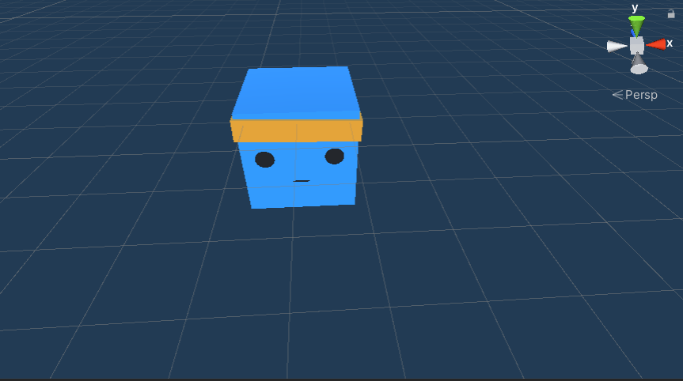
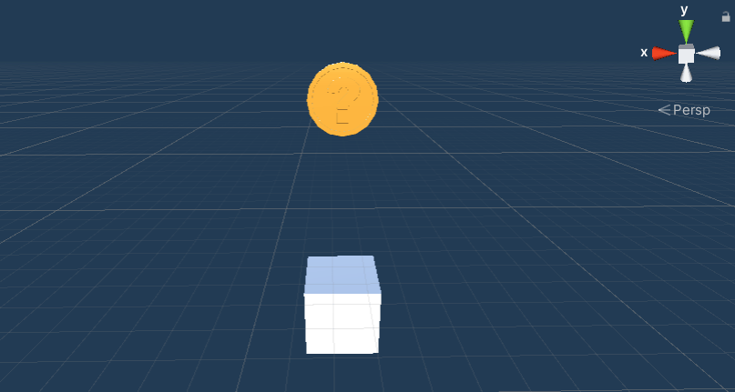
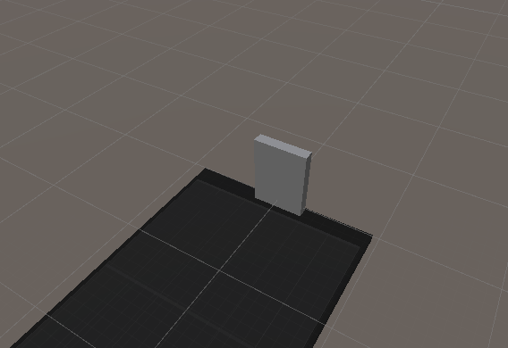
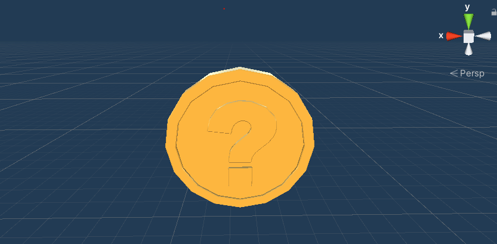
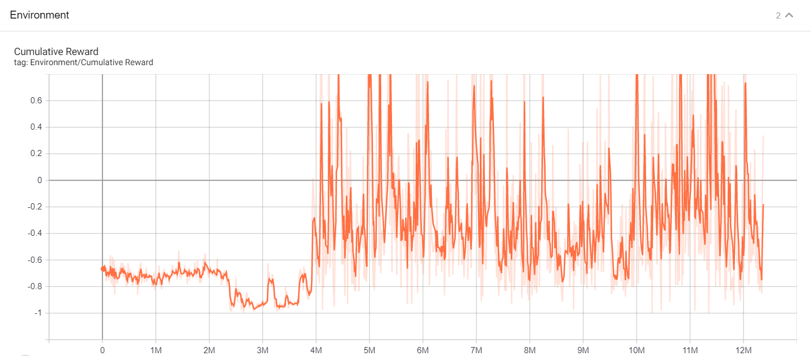
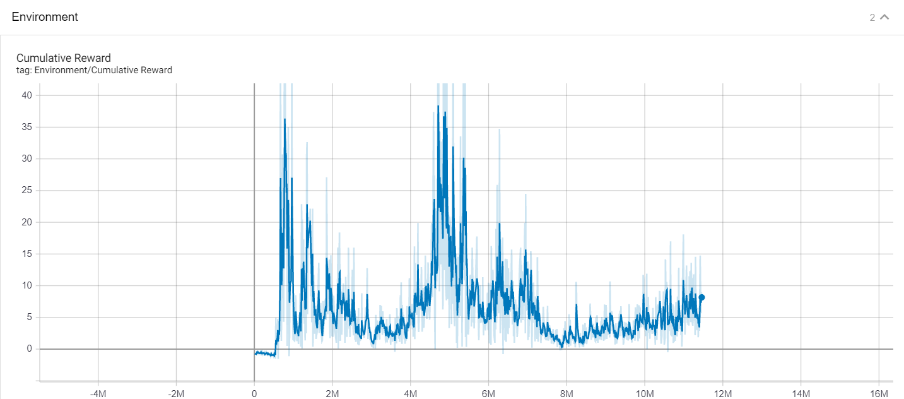
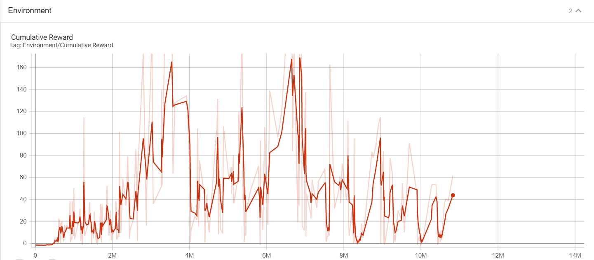

# Jumper Exercise

## Laura Dirckx & Nico Chauvaux

### Inhoudstafel

### Spelverloop

Maak een zelflerende agent aan die een obstakel ontwijkt door er over te springen. Het obstakel krijgt elke episode een andere snelheid mee. De agent wordt geconfronteerd met een rij van continu bewegende obstakels.

### Stap 1

Brainstorming, voorbeelden bekijken van ML-agents.

### Stap 2

New Unity Project, dan een stage maken, dan Agent overnemen van ML-agents.

### Stap 3

Scripts bekijken en aanpassen van ML-agents voorbeeld (WallJump).

#### Agent/Jumper



Eerst een script schrijven zodat de agent kan springen. Daarna maken we van dit 'normaal' script een Agent.

**jump script**


```
public class Jump : Agent
{
    [SerializeField] private float jumpForce;
    [SerializeField] private KeyCode jumpKey;

    private bool jumpIsReady = true;
    private Rigidbody rBody;
    private Vector3 startingPosition;
    private int score = 0;
    public event Action OnReset;

    public override void Initialize()
    {
        rBody = GetComponent<Rigidbody>();
        startingPosition = transform.position;
    }

    private void FixedUpdate()
    {
        if (jumpIsReady)
            RequestDecision();

        if (transform.position.y <= 1.2)
        {
            AddReward(0.001f);
        }
    }

    public override void OnActionReceived(float[] vectorAction)
    {
        if ( Mathf.FloorToInt(vectorAction[0]) == 1)    
            Jumper();            
    }

    public override void OnEpisodeBegin()
    {
        Reset();
    }

    public override void Heuristic(float[] actionsOut)
    {
        actionsOut[0] = 0;
        if (Input.GetKey(jumpKey))
            actionsOut[0] = 1;
    }

    private void Jumper()
    {
        if (jumpIsReady)
        {
            rBody.AddForce(new Vector3(0, jumpForce, 0), ForceMode.VelocityChange);
            jumpIsReady = false;
            AddReward(-0.2f);
        }
    }


    private void Reset()
    {
        score = 0;
        jumpIsReady = true;

        //Reset Movement and Position
        transform.position = startingPosition;
        rBody.velocity = Vector3.zero;

        OnReset?.Invoke();
    }

    private void OnCollisionEnter(Collision collidedObj)
    {
        if (collidedObj.gameObject.CompareTag("Platform"))
            jumpIsReady = true;

        else if (collidedObj.gameObject.CompareTag("Enemy"))
        {
            AddReward(-1.0f);
            Debug.Log(GetCumulativeReward());
            EndEpisode();
        }
           
    }

    private void OnTriggerEnter(Collider collidedObj)
    {
        if (collidedObj.gameObject.CompareTag("score"))
        {
            AddReward(0.5f);
            score++;
            ScoreCollector.Instance.AddScore(score);
        }
    }
}
```

#### Enemyblock

'enemyblock' die op random snelheid in één richting beweegt.



#### Wall of death

We gebruiken een 'wall of death' zodat de 'enemyblocks' verwijdert worden.



#### Coin

Om de Agent te kunnen belonen voor het springen, gebruiken we coins die boven de enemyblocks zweven. Als de agent deze vangt, krijgt hij een reward.



#### Spawner

We hebben een overkoepelend gameobject genaamd 'Spawner', in dit gameobject specifiëren we het gedrag van zijn child objecten.

We werken met een 'spawnvolume' waar de enemyblocks in moeten spawnen. Hierdoor word het makkelijk om later het spawnvolume te verplaatsen.

Ook word de enemyblock uit een lijst gehaald. Dit is naar later ook makkelijker als er meer enemyblocks zouden moeten aangemaakt worden.

```
Environment
│
└───Spawner
│   │
│   └───Agent
│   │
│   └───Wall of death
│   │
│   └───SpawnVolume
|
└───Scenery
    │   Platform
```

```
public class Spawner : MonoBehaviour
{
    [SerializeField] private List<GameObject> spawnableObjects;
   

   
    [SerializeField] private GameObject Spawnvolume;

    private Jump jumper;
    private List<GameObject> spawnedObjects = new List<GameObject>();
    private const float SPAWN_TIMER = 3f;
    public float Timer = SPAWN_TIMER;

    private void Awake()
    {
        jumper = GetComponentInChildren<Jump>();
        jumper.OnReset += DestroyAllSpawnedObjects;

      
    }

   private void Update()
    {
        Timer -= Time.deltaTime;
        if (Timer <= 0f)
        {
            GameObject newEnemyBlock = Instantiate(GetRandomSpawnableFromList().gameObject);
            newEnemyBlock.transform.localPosition = Spawnvolume.transform.position;
            spawnedObjects.Add(newEnemyBlock);

            Timer = SPAWN_TIMER;
        }
    }

    private void DestroyAllSpawnedObjects()
    {
        for (int i = spawnedObjects.Count - 1; i >= 0; i--)
        {
            Destroy(spawnedObjects[i]);
            spawnedObjects.RemoveAt(i);
        }
    }
    private GameObject GetRandomSpawnableFromList()
    {
        int randomIndex = UnityEngine.Random.Range(0, spawnableObjects.Count);
       
        return spawnableObjects[randomIndex];
    }
}
```

### Stap 4

Het spel zelf testen. Daarna alles toevoegen om er een Agent van te maken, een Decision requester en alle nodige configuratie.

### Stap 5

#### Eerste training

**yml-parameters:**

    behaviors:

    Jump:
  
    trainer_type: ppo
    max_steps: 5.0e7
    time_horizon: 64
    summary_freq: 10000
    keep_checkpoints: 5
    checkpoint_interval: 50000
    
    hyperparameters:
      batch_size: 32
      buffer_size: 9600
      learning_rate: 3.0e-4
      learning_rate_schedule: constant
      beta: 5.0e-3
      epsilon: 0.2
      lambd: 0.95
      num_epoch: 3

    network_settings:
      num_layers: 2
      hidden_units: 128
      normalize: false
      vis_encoder_type: simple

    reward_signals:
      extrinsic:
        strength: 1.0
        gamma: 0.99
      curiosity:
        strength: 0.01
        gamma: 0.99
        encoding_size: 256
        learning_rate : 1e-3

**Reward systeem:**

* Collision met enemy block: -1
* Het pakken van een coin: +0.1



**Conclusie:** Rare resultaten. Het reward systeem wordt herzien. Agent wordt ook niet afgestraft om te springen dus als resultaat springt de Agent continu.

#### Tweede training

**yml paramaters:**

De YAML parameters zijn dezelfde als die van run 1.

**Reward systeem:**

* Collision met enemy block: -1
* Het pakken van een coin: +0.5
* Sprongen die de agent maakt: -0.2



**Conclusie:** Betere topresultaten als vorige run, toevoegen van jump punishment was een goede beslissing. Agent wacht tot Enemy dicht genoeg komt, maar heeft weinig tijd om te reageren aangezien de spawnrate 2 seconden is.
Nieuwe run zal met een hogere spawntimer zijn van Enemy (Om de 3 seconden ipv om de 2).

#### Derde training

**yml parameters:**

De YAML parameters zijn nog steeds dezelfde als die van de vorige runs.

**Reward systeem**

* Collision met enemy block: -1
* Het pakken van een coin: +0.5
* Sprongen die de agent maakt: -0.2
* Per frame dat de agent op de grond blijft staan: +0.001

**Environments**

Eerste twee runs waren met 8 environments, nu met 6.



**Conclusie:** De resultaten zijn nog niet helemaal zoals we verwacht hadden. De agent heeft nog veel te veel dalingen en blijft niet consistent op dezelfde cumulatieve reward.

### Bronvermelding

Schuchmann, S. S. (2020, May 19). Ultimate Walkthrough for ML-Agents in Unity3D. Towardsdatascience. <https://towardsdatascience.com/ultimate-walkthrough-for-ml-agents-in-unity3d-5603f76f68b?gi=24091b69b52d>
